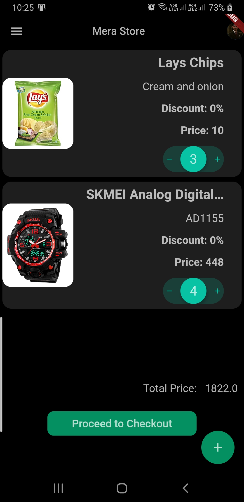

# Mera Store

E-POS Barcode scanner and checkout for Mobile in Flutter

# About the app

Mera Store is a simple e pod barcode scanner and e commerce app made in Flutter.  
Scan the barcodes and add them as products.

# Backend
Authentication: Firebase Auth
Backend: Firebase Firestore

# Database Configuration

